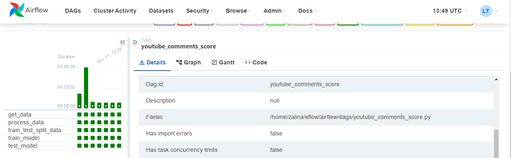
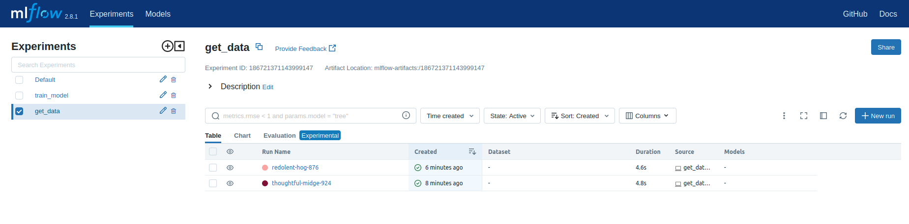

 
# Airflow & Mlflow Example Pipeline for Machine Learning (Local Development)

В этом репозитории показан пример Apache Airflow pipeline для локальной разработки проектов.


## Usage
Для того, чтобы воспроизвести папйплайн, выполните следующие шаги:

1. Создайте виртуальное окружение

   ```
   python3 -m venv env
   ```

2. Установите и настройте airflow

   ```
   pip3 install "apache-airflow[celery]==2.7.3" --constraint "https://raw.githubusercontent.com/apache/airflow/constraints-2.7.3/constraints-3.8.txt"
   export AIRFLOW_HOME=/home/your_user/xflow/airflow
   airflow db init
   ```

3. Установка и запуск mlflow

   ```
   pip3 install mlflow
   mlflow ui
   ```

4. Запустите Airflow webserver и sheduler :

    ```
    airflow webserver -p 8080
    ```
   
   ```
    airflow scheduler
   ```

5. Доступ к Airflow web interface в браузере по адресу: http://localhost:8080.

6. В папку airflow/dags помещаем скрипт [youtube_comments_score.py](airflow%2Fdags%2Fyoutube_comments_score.py), чтобы инициализировать выполнение пайплайна.

7. Результаты запуска пайплайна:

   

8. Отслеживание экспериментов в mlflow
   


